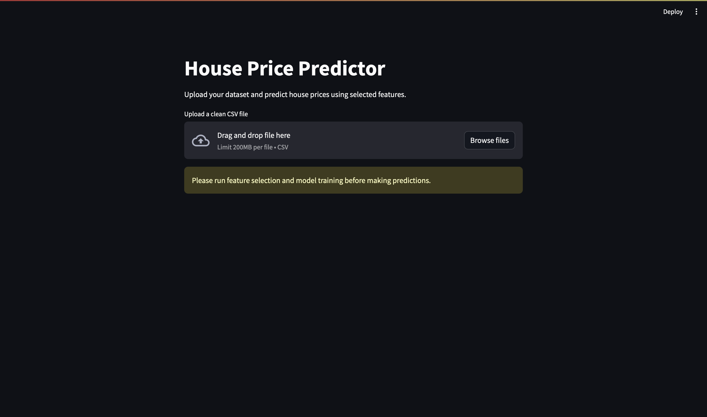
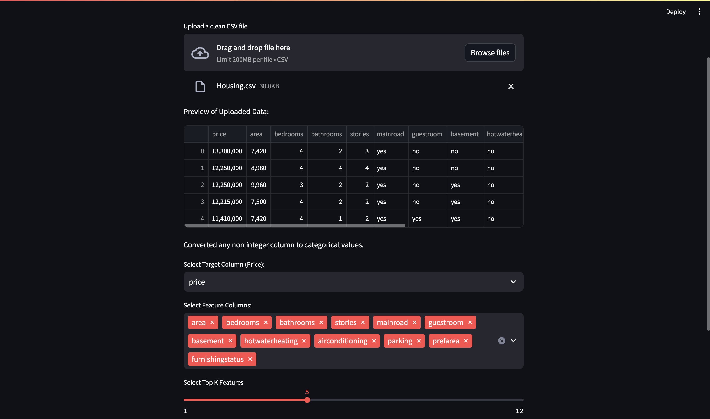
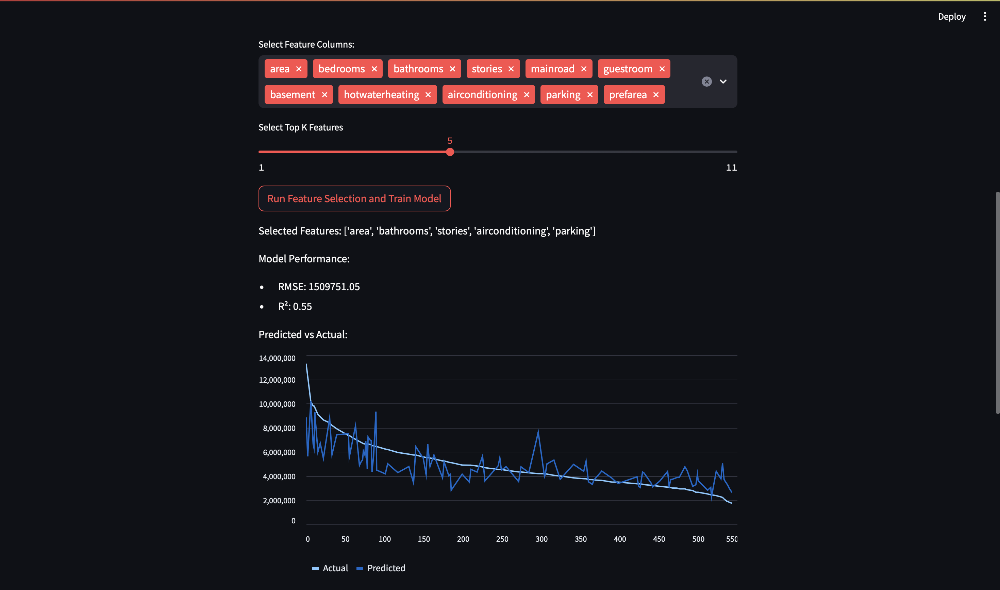
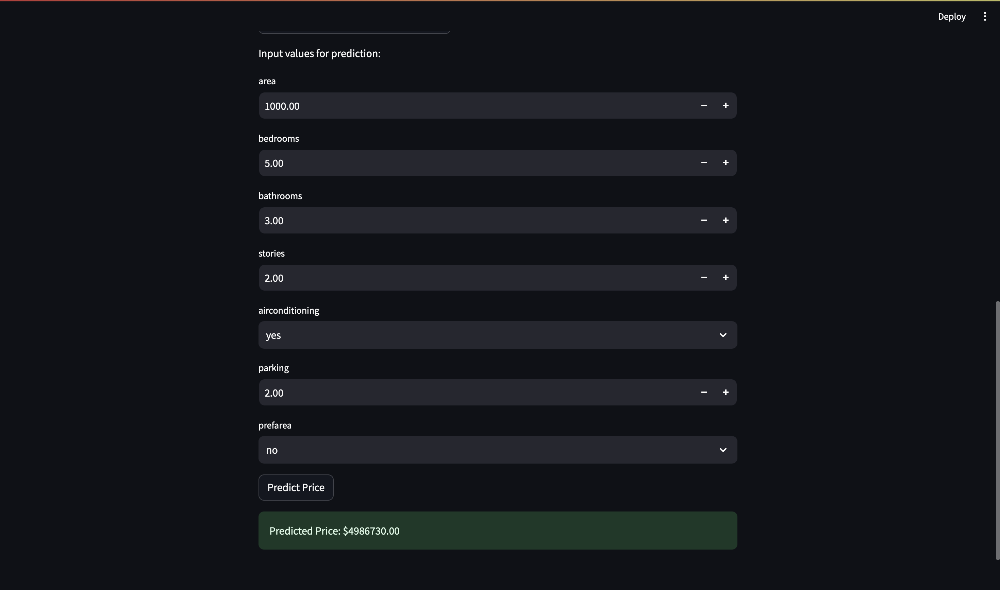

# 🏠 House Price Predictor Web App

## Overview

The **House Price Predictor** is an interactive web app built with **Streamlit** that uses machine learning to predict housing prices based on user-provided features. It allows users to upload their datasets, perform feature selection, and make predictions in real-time using a **Random Forest Regressor**.

## Features

- **Customizable Dataset Input**: Upload your own dataset (CSV format) and view a preview of the data.
- **Data Preprocessing**: Automatically converts categorical columns into numeric values for seamless model training.
- **Feature Selection**: Select the target variable and top predictive features using `SelectKBest`.
- **Model Training**: Trains a **Random Forest Regressor** and evaluates performance with RMSE and R² metrics.
- **Real-Time Predictions**: Provides an intuitive interface to input feature values and predict housing prices.
- **Visualization**: Displays predicted vs actual results for better model interpretability.

## Technologies Used

- **Python**: Backend programming language.
- **Streamlit**: Framework for building the interactive web app.
- **Scikit-learn**: For data preprocessing, feature selection, and machine learning.
- **Pandas**: For dataset handling and preprocessing.
- **NumPy**: For efficient numerical computations.
- **Matplotlib**: For visualizing model predictions and performance.

## How to Run

### Prerequisites

1. Install Python 3.7 or later.
2. Install the required Python packages:
   ```bash
   pip install streamlit pandas scikit-learn matplotlib
   ```

### Steps to Run

1. Clone the repository:
   ```bash
   git clone <repository_url>
   cd <repository_folder>
   ```
2. Run the Streamlit app:
   ```bash
   streamlit run app.py
   ```
3. Open the app in your browser at `http://localhost:8501`.

### Usage

1. Upload a clean CSV dataset containing your features and target column.
2. Select the target column and features for training.
3. Train the model by clicking **Run Feature Selection and Train Model**.
4. Enter feature values for prediction and click **Predict Price** to get the results.

## Example Dataset

The dataset should be a CSV file with rows as data samples and columns as features. Example structure:

```csv
SquareFeet,Bedrooms,Bathrooms,Neighborhood,Price
2000,3,2,Downtown,400000
1500,2,1,Suburb,250000
2500,4,3,Uptown,500000
1200,2,1,Suburb,200000
```

- `Neighborhood` will be converted to numeric values (`Downtown → 0, Suburb → 1, Uptown → 2`).
- `Price` is the target column.

## Screenshots

### Main Interface



### File Upload



### Model Evaluation



### Predictions



## Future Improvements

- Add support for model hyperparameter tuning.
- Enable saving and loading trained models.
- Support additional machine learning algorithms.
